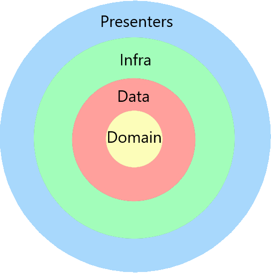

<h1 align="center">
     🤖 <a href="#" alt="site do places"> AWR CLI</a>
</h1>

<h3 align="center">
    ⚙️ A CLI para padronizar a criação e evolução de nossos projetos. 💗
</h3>

<div align="center">
<p align="center">
<a></a>
<a></a>
<a></a>
<a></a>
</p>
</div>

Tabela de conteúdos
=================
<!--ts-->
   * [Sobre o projeto](#-sobre-o-projeto)
   * [Funcionalidades](#%EF%B8%8F-funcionalidades)
   * [Como executar o projeto](#-como-executar-o-projeto)
     * [Pré-requisitos](#pré-requisitos)
     * [Rodando/Criando um executável novo para a CLI](#-rodandocriando-um-executável-novo-para-a-cli)
   * [Tecnologias](#-tecnologias)
     * [CLI](#cli-rust)
   * [Estrutura do Template do Projeto](#-estrutura-do-template-do-projeto)
   * [Como usar](#-como-usar)
     * [No Linux](#linux)
   * [Autor](#-autor)
   * [Licença](#-licença)
<!--te-->


## 💻 Sobre o projeto

🤖 AWR CLI - é uma forma de criar e evoluir projetos utilizando o padrão adotado pela AWR.

É uma Interface de Linha de Comando que permite criar novos projetos em NestJS utilizando Clean Archtecture e DDD.

---

## ⚙️ Funcionalidades

- [x] NestJS:
  - [x] Criar projeto com base no template
```bash
awr nest new hello-world
```

---

## 🚀 Como executar o projeto

### Pré-requisitos

Antes de começar, você vai precisar ter instalado em sua máquina a seguinte ferramenta:
[Rust](https://rustup.rs/).
Além disto é bom ter um editor para trabalhar com o código como [VSCode](https://code.visualstudio.com/)

#### 🎲 Rodando/Criando um executável novo para a CLI

```bash

# Clone este repositório
$ git clone git@github.com:andrewronscki/awr-cli.git

# Acesse a pasta do projeto no terminal/cmd
$ cd awr-cli

# Execute a CLI com o seguinte comando
$ cargo run nest new hello-world

# Será criado uma pasta com o nome hello-world e nele irá conter o template do projeto
# Na pasta target/debug terá sido criado um arquivo executavel chamado awr, rodando no windows ele criará um executável chamado awr.exe

```

---

## 🛠 Tecnologias

As seguintes ferramentas foram usadas na construção do projeto:

#### [](https://github.com/andrewronscki/awr-cli)**CLI** ([Rust](https://www.rust-lang.org/pt-BR))
-   **[clap](https://docs.rs/crate/clap/4.0.32)**
-   **[error-chain](https://docs.rs/crate/error-chain/0.12.4)**
-   **[reqwest](https://docs.rs/crate/reqwest/0.11.13)**
-   **[tokio](https://docs.rs/crate/tokio/1.24.1)**
-   **[zip](https://docs.rs/crate/zip/0.6.3)**

> Veja o arquivo  [Cargo.toml](https://github.com/andrewronscki/awr-cli/blob/main/Cargo.toml)

---

## 🛠 Estrutura do Template do Projeto
A estrutura do template do projeto segue este modelo:
- O sistema deve ser desenvolvido utilizando os ensinamentos do Clean Architecture e Domain-Driven Design, separando as camadas em domain, data, infra e presentation;
- O sistema deve ser agrupado por módulos independentes;
- O desenvolvimento dos casos de uso deve ser orientado a testes (TDD).

<div align="center">
  
</div>

---

## 👨‍💻 Como usar
### Linux
- Baixe o arquivo awr <a href="https://github.com/andrewronscki/awr-cli/blob/main/awr" target="_blank">clicando aqui!</a>
- Após baixar, abra o terminal e siga os passos a seguir:
```bash
# Criar pasta .awr
mkdir .awr

# Mover arquivo baixado para pasta .awr
mv ~/downloads/awr ~/.awr/

# Dar permissão de execução e escrita para o arquivo
cd .awr
chmod 755 awr
```
- Adicionar no arquivo *.bashrc* ou *.zshrc* o caminho para o executável no PATH:
```
# Exemplo no .zshrc
export PATH="$HOME/.awr:$PATH"
```
- Agora basta testar utilizando o seguinte comando em qualquer pasta do seu terminal:
```
awr nest new hello-world

# Deverá criar uma pasta chamada hello-world com o template do projeto.
```

<br />

-***“Que a Força esteja com você”***

---

## 🦸 Autor

<a href="https://andrewronscki.com">
 
 <br />
 <sub><b>André Wronscki Ricardo</b></sub></a> <a href="https://andrewronscki.com" title="André Wronscki">🚀</a>
 <br />
 <br />


[](https://www.linkedin.com/in/andr%C3%A9-wronscki-ricardo-13694bb7/)
[](mailto:andrewronscki@gmail.com)

---

## 📝 Licença

Este projeto esta sobe a licença [MIT](./LICENSE.md).
